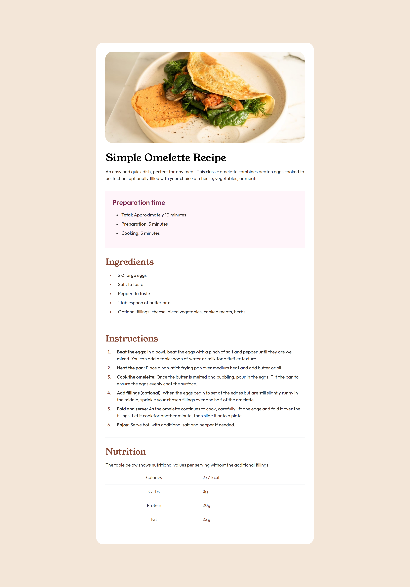

# Frontend Mentor - Recipe page solution

This is a solution to the [Recipe page challenge on Frontend Mentor](https://www.frontendmentor.io/challenges/recipe-page-KiTsR8QQKm). Frontend Mentor challenges help you improve your coding skills by building realistic projects.

## Table of contents

- [Overview](#overview)
  - [The challenge](#the-challenge)
  - [Screenshot](#screenshot)
  - [Links](#links)
- [My process](#my-process)
  - [Built with](#built-with)
  - [What I learned](#what-i-learned)
  - [Useful resources](#useful-resources)
- [Author](#author)

## Overview

### Screenshot

### Links

- Solution URL: [Add solution URL here](https://your-solution-url.com)
- Live Site URL: [Add live site URL here](https://your-live-site-url.com)

## My process

### Built with

- Semantic HTML5 markup
- CSS custom properties
- Flexbox
- CSS Grid
- Mobile-first workflow
- [Tailwind](https://tailwindcss.com/) - Tailwind CSS Framework

### What I learned

It was great experience while making this project. I have gain more confidence to use html Tags and CSS properties. Also, I have learned few extra thing i.e. HTML (Order list, Unorder list & Table) & CSS (Table styling, Order-list Styling). I tried to make similar as in the design.

### Useful resources

- [MDN Web Docs](https://developer.mozilla.org/en-US/) - MDN Web Docs is very useful for Web-developer. This website gives you every details for HTML and CSS.
- [Tailwind Documentation](https://tailwindcss.com/) - This is tailwind CSS which helped me to create this beautiful recpie page in less line of css code.

## Author

- Frontend Mentor - [@djbravo12](https://www.frontendmentor.io/profile/djbravo12)
- Twitter - [@_Bunny_1](https://twitter.com/_Bunny_1)
- Github - [@djbravo12](https://github.com/djbravo12)
- Linkedin - [@vineet-kumar-2206b2109](https://www.linkedin.com/in/vineet-kumar-2206b2109/)

